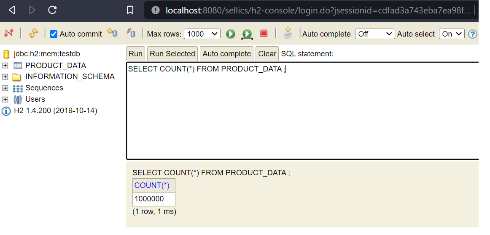
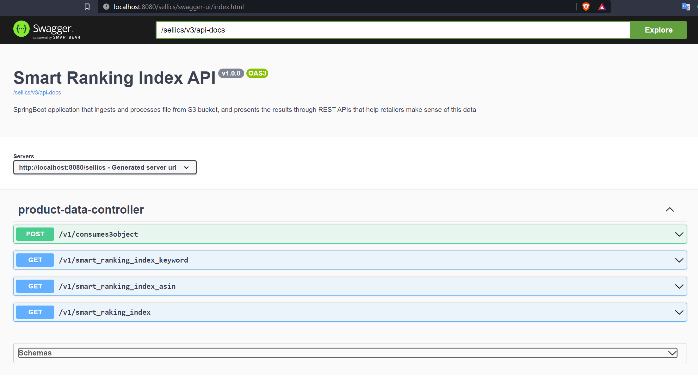

<div id="header" align="center">
  
</div>
<div id="badges" align="center">
  <a href="https://www.linkedin.com/in/ajith-solomon-sekar">
    
  </a>
</div>

# Sellics CaseStudy for Search Ranking Index API

[Spring Boot](http://projects.spring.io/spring-boot/) application that ingests and processes csv file from AWS S3 bucket, and presents the results through REST APIs that help retailers make sense of this data as follows:

* a time series containing the individual ranks for an ASIN, for a certain keyword
* a time series containing the aggregated ranks for all ASINs for a certain keyword
* a time series containing the aggregated ranks of all keywords for a certain ASIN

## Requirements

For building and running the application you need:

* 	[JDK](https://www.oracle.com/java/technologies/downloads/#java11) - Java SE Development Kit 11
* 	[Maven](https://maven.apache.org/download.cgi) - Project Management Tool

### Running the application with IDE

There are several ways to run a Spring Boot application on your local machine. One way is to execute the `main` method in the `com.sellics.casestudy.SellicsCaseStudyApplication` class from your IDE.

* 	Download the zip or clone the Git repository.
* 	Unzip the zip file (if you downloaded one)
* 	Open Command Prompt and Change directory (cd) to folder containing pom.xml
* 	Open Eclipse
	* File -> Import -> Existing Maven Project -> Navigate to the folder where you unzipped the zip
	* Select the project
* 	Choose the Spring Boot Application file (search for @SpringBootApplication)
* 	Right Click on the file and Run as Java Application

* 	URL to access application: **http://localhost:8080/sellics/**

### Running the application with Maven

Alternatively you can use the [Spring Boot Maven plugin](https://docs.spring.io/spring-boot/docs/current/reference/html/build-tool-plugins-maven-plugin.html) like so:

```shell
$ git clone https://github.com/ajithsolomonsekar/sellics.casestudy.git
$ cd sellics.casestudy
$ mvn spring-boot:run

```shell
mvn spring-boot:run
```
### Accessing Data in H2 Database

#### H2 Console

URL to access H2 console: **http://localhost:8080/sellics/h2-console**

Fill the login form as follows and click on Connect:

* 	Saved Settings: **Generic H2 (Embedded)**
* 	Setting Name: **Generic H2 (Embedded)**
* 	Driver class: **org.h2.Driver**
* 	JDBC URL: **jdbc:h2:mem:testdb**
* 	User Name: **sa**
* 	Password:




### Testing API

Once the application is Up, It will start consuming the s3 object asynchronously and load the object csv data to in-memory H2 database. In case of any exception during this data load, we can use below API to trigger the process to consume s3 object again.

POST **http://localhost:8080/sellics/v1/consumes3object**

#### To get a time series containing the individual ranks for an ASIN, for a certain keyword
GET **http://localhost:8080/sellics/v1/smart_raking_index?asin=B07334WXN5&keyword=woodgrain%20watches%20men**

#### To get a time series containing the aggregated ranks for all ASINs for a certain keyword
GET **http://localhost:8080/sellics/v1/smart_ranking_index_keyword?keyword=woodgrain%20watches%20men**

#### To get a time series containing the aggregated ranks of all keywords for a certain ASIN
GET **http://localhost:8080/sellics/v1/smart_ranking_index_asin?asin=B07334WXN5**

Response for all three endpoints will be in the format of **JSON TIME SERIES** and documentation for same can be found [here](https://docs.eagle.io/en/latest/reference/historic/jts.html#)

## Postman Collection

Postman collection can be downloaded from **https://www.getpostman.com/collections/6a6521919a8996f5de9a**

## Swagger Documentation

Swagger API documentation can be found at **http://localhost:8080/sellics/swagger-ui/index.html**


